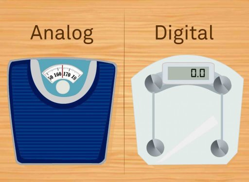

# Introduction

# Systems
A system takes inputs, does something with them, and produces outputs.

There are two types of systems:
1. Digital Systems
2. Analog Systems

They differ in how they represent information. Digital signals are discrete, represented by binary values (0s and 1s) while Analog signals are continous, using a range of values to convey data.

  

